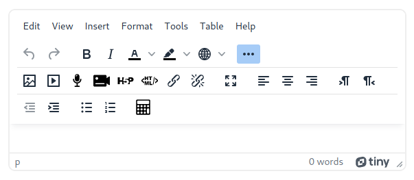
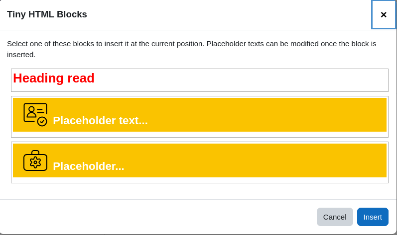
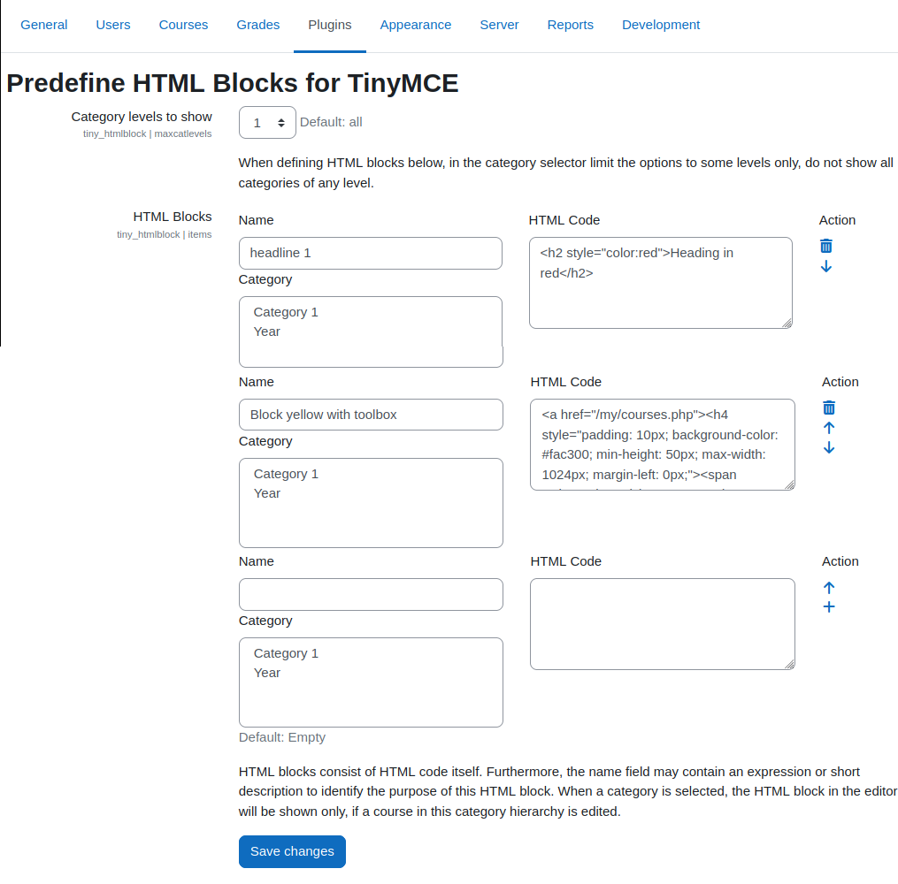

# Moodle Tiny editor HTML Block plugin

A plugin for the Moodle TinyMCE editor to insert predefined HTML blocks when editing a text
in Moodle.

## Overview

To design Moodle courses in an appealing way, a good design is required. This demands
some knowledge in HTML. In contrast, many teachers lack the knowledge in web technologies
such as HTML to design a course. Also, less technical experienced users try to avoid the
source code view of the editor and rather rely on the WYSIWYG mode.

In addition, even though having different courses, the look and feel should be very similar
throughout Moodle and should follow the corporate design. This requires that the courses are
styled in the same way.

This plugin allows the administrators of moodle to define some more sophisticated HTML blocks
with inline styling. These so defined blocks can be easily inserted by a teacher without
the need to modify the HTML itself.

## Installation

- Create a new directory `htmlblock` inside the directory `*moodleroot*/lib/editor/tiny/plugins`.
- Copy repository content into the newly created directory.
- Install the plugin via the Moodle upgrade page.
- Go to "Site administration" -> Tab "Plugins" -> "Text editors" -> "Predefine HTML Blocks for TinyMCE"
  and define at least one HTML block.

## Usage

When a text area is edited a new toolbar button appears with the HTML symbol.

In addition, in the menu *Insert* -> *HTML blocks* appears.

Both, clicking the toolbar button or the menu item opens a modal dialogue
where all the predefined HTML blocks are listed. The user may click on one
(it gets selected) and then click the *Insert* button to actually insert
the HTML at the current cursor position in the text.

The so inserted content can later be changed or entirely
removed like any other elements in the editor. The behaviour is pretty much
comparable to the workflow of inserting a special char, with the difference
that a more complex design element is inserted.

## Detailed description

In general the plugin behaves the same for any text area that is modified via the TinyMCE editor.
However, a few refinements can be applied and limitations must be observed.

### Admin Settings

#### HTML blocks

All html blocks are displayed in a list. In addition to the HTML itself, each
entry may also contain:

* A descriptive name (used in a tool tip when hovering over the list in the modal dialogue)
* A category setting

The category setting limits the HTML block being listed on course pages only. Furthermore, with
the category setting, different HTML blocks are possible for different categories. This might be
useful if you have a category structure that is divided into hierarchies by departments and there
is a top level category for each department. Depending on where a course is placed in the
category hierarchy the appropriate styled blocks can be used within the course.

If a block has no category setting, it can be used always and also on text fields that are
not within a course (e.g. on the user profile). In the same way blocks that have a category
setting cannot be used on any other page, and also not on a course that is not within that
category hierarchy.

#### Category levels to show

The setting of the category level may shrink the list of categories for each HTML block to
a certain level of categories only. If HTML blocks are classified to be used in certain
courses only (e.g. they contain a certain style or colour), the block can be classified
by defining one or more categories where it can be used if a course exists within that
category hierarchy. Thus, the list of blocks to be inserted can be limited and offers these
items only, that are suited for that course.

If the courses can be distinguished by the the top category level, then set 1 here and in
the HTML block items the top level categories are shown only.

Once you click save, the setting is stored. When the page is reloaded with the new setting
you will notice the change in the category selector of each HTML block.

This setting has no effect when using the plugin while editing a text.

### Technical background

The HTML that can be defined in the admin area can contain any of the HTML elements that are
allowed at the site. However, there is no general media space that is accessible throughout
all courses. Whenever you need images (icons etc.), you have two options:

- Upload the image files to some public webspace via SFTP, Webdav. This can be the Moodle
  server but must not be done within Moodle itself.
- Use inline images by encoding the image itself as a base64 encoded string. An inline image
  may look like ``.

You may use classes in your HTML do adapt the styling from some predefined classes that exist
on the page. However, depending on where the HTML block is used a style might be applied or not
depending on the class hierarchy at the current position. This counts even more when using
te HTML in the editor in the modal dialogue. Therefore, it is recommended to use inline styles
that are placed inside the `style` attributes of an element.

#### Settings for the HTML blocks

The settings are stored in the database in the config table of the plugins (like any other
setting). However, the settings value is stored in a text field that has a maximum length of
65535 bytes in a MySQL database (Postgres and Oracle may tolerate a higher limit). The value
of the `items` setting contains all HTML blocks that are defined. The so encoded json string
might exceed the maximum length allowed in the database. This might happend when many
inline images (with base64 encoded data) are used. Therefore, the value is also written
into a file at `/dir/to/moodledata/tiny_htmlblock.json`.

## Current status and future improvements

The plugin is still in development. Most of the general features work.

What is missing/not working:

- Links and other elements may need a placeholder (e.g. inserting a link to the current
  section) that the user can easily apply when using the HTML block during an edit. At the
  moment the link target must be placed inside the block definition itself or the user
  must switch to the source mode (and losing the advantage of an easy handling without
  interacting with the HTML itself).
- Classification of blocks with tags. If there is a huge list of possible HTML blocks to
  pick from, using a click on one of the tags above the list would filter the entries by
  that specific tag.

## Version History

### 1.4
- Support Moodle 4.4 and PHP 8.3.
- Lift software maturity to stable.

### 1.3
- Additional fixes from the approval feedback.
- Rename capability to `tiny/htmlblock:add`.
- Different styling in the html block list in the dialogue.

### 1.2
- Fix [tiny/htmlblock:viewmenu does not seem to have any effect #2](https://github.com/srobotta/moodle-tiny_htmlblock/issues/2)
- Fix [Module and course settings not accessible #4](https://github.com/srobotta/moodle-tiny_htmlblock/issues/4)
- Fix phpcs issues that were reported during the review process.
- New SVG icon for the toolbar and the plugin itself.
- Improved language string.

### 1.1
- Fix compatibility issue with Moodle 4.3
- Add CI stack for Moodle 4.3

### 1.0

Initial release waiting for approval